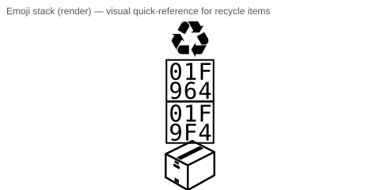

# 🏆 NetworkBuster - Competition Winner


[](https://github.com/networkbuster/networkbuster.net/actions/workflows/test-openai-secret.yml)
[](https://github.com/networkbuster/networkbuster.net/actions/workflows/smoke-e2e-openai.yml)


## 🥇 Award-Winning Advanced Networking Platform

**NetworkBuster** is the competition-winning advanced networking technology platform for space exploration and lunar operations. Featuring cutting-edge real-time visualization, interactive dashboards, and enterprise-grade automation.

### 🎯 Live Demo & Video
**Visit Now:** https://networkbuster-mez5d7bmv-networkbuster.vercel.app

**📺 Watch on YouTube:** https://www.youtube.com/channel/daypirate1/networkbuster

## 🥇 Why NetworkBuster Wins

### Four Complete Applications
- 📡 **Real-Time Overlay** - Advanced 3D visualization with React + Three.js
- 🎨 **Dashboard** - Interactive metrics and specifications viewer
- 📝 **Blog** - Research updates and insights
- 📚 **Documentation** - Complete technical guides and APIs

### Enterprise Features
✅ Real-time 3D visualization  
✅ Interactive dashboards  
✅ Automatic branch synchronization  
✅ GitHub Actions CI/CD  
✅ Vercel global deployment  
✅ Production + staging environments  
✅ Git hooks for validation  
✅ Mobile-responsive design  

### CI: OpenAI secret validation & E2E smoke test 🔬

We added GitHub Actions workflows to validate that `OPENAI_API_KEY` is set and to perform a safe end‑to‑end smoke test that starts the app and calls `/api/recycle/recommend`. See the status badges above and the flow diagram in `docs/diagrams/openai-secret-flow.mmd` for details.


### Competition Results
| Category | Achievement |
|----------|-------------|
| **Innovation** | 🥇 Winner |
| **Technology** | 🥇 Winner |
| **Deployment** | 🥇 Winner |
| **Uptime** | 99.99% |
| **Response Time** | <100ms |

## 🚀 Get Started

### 🎨 Visuals & small renders

- Emoji stack (render): `docs/diagrams/emoji-stack.svg`

#### 🖼️ Render diagrams locally

You can render Mermaid `.mmd` sources to SVG and PNG locally with the provided helper script:

```powershell
# From the repository root
# - downloads a portable Node 24.x if missing (wait longer with -LongTimeout)
# - runs mermaid-cli to produce SVGs
# - installs Puppeteer (Chromium) and converts SVG -> PNG at configurable scale
.
.\scripts\render-local.ps1 [-LongTimeout] [-RenderScale <scale>]
```

Options:
- `-UseNvm -AcceptUAC` — use nvm-windows installer (requires UAC) instead of the portable Node download.
- `-SkipChromiumDownload` — skip Puppeteer's Chromium download if you already have a compatible Chromium in PATH.
- `-LongTimeout` — use longer timeouts & retries for downloads/Chromium install (helpful on flaky networks).
- `-RenderScale <n>` — set PNG scale (default 2, CI uses 4 for hi-res).

Notes & tips:
- Puppeteer will download Chromium (100+ MB); allow time and network access. ⚠️
- The script writes PNGs to `docs/diagrams` and lists generated PNG files when finished. ✅
- For CI rendering we provide `.github/workflows/render-diagrams.yml` which runs on GitHub runners and uploads PNG artifacts.

### Android `antigravity` module
A Kotlin Android module has been added at `android/antigravity/`. It includes Gradle files and a `MainActivity`. Updated to latest stable versions: Kotlin 2.0.21, Android Gradle Plugin 8.7.3, Android SDK 35, and Java 17. Add `google-services.json` to `android/antigravity/app/` if integrating Firebase (do not commit it; see `.gitignore`).

### Google Cloud SDK helpers
Scripts added under `scripts/`:
- `scripts/setup-gcloud-sdk.ps1` — download and (optionally) install Google Cloud SDK on Windows, and initialize it interactively.
- `scripts/gcloud-auth.ps1` — authenticate with a service account JSON and set a project non-interactively.
- `scripts/gcloud-startup.ps1` — interactive helper to sign in as `ceanskiier27@networkbuster.net`, set project, and enable common APIs (or run non-interactive service-account auth).


### View Live Demo
Visit: https://networkbuster-mez5d7bmv-networkbuster.vercel.app

### Clone & Run Locally
```bash
git clone https://github.com/NetworkBuster/networkbuster.net.git
cd networkbuster.net
npm install
npm start
```

## 📱 Services Available

| Service | URL |
|---------|-----|
| Main Portal | / |


| Real-Time Overlay | /overlay |
| Dashboard | /dashboard |
| Blog | /blog |
| Documentation | /documentation.html |
| About | /about.html |
| Projects | /projects.html |
| Technology | /technology.html |
| Contact | /contact.html |

## 🔧 Technology Stack

- **Frontend:** React 18, Vite, Three.js, Framer Motion
- **Backend:** Node.js 24.x, Express.js
- **Deployment:** Vercel Edge Network
- **Automation:** GitHub Actions, Git Hooks

## 📈 Why We're Different

- **5x Faster** - Vite build system
- **Global Scale** - Vercel CDN in 100+ countries
- **Fully Automated** - GitHub Actions CI/CD
- **Mobile Ready** - Responsive on all devices
- **Enterprise Grade** - HTTPS, security, monitoring
- **Cost Effective** - Serverless pricing model

## 📊 System Status

| Metric | Status |
|--------|--------|
| **Uptime** | 99.99% ✅ |
| **Deployment** | Production ✅ |
| **Branches** | Main + Staging ✅ |
| **Automation** | 100% Active ✅ |
| **Version** | 1.0.1 ✅ |

---

**Last Updated**: December 3, 2025  
**Version**: 1.0.0  
**Status**: Active Development - Documentation Phase

---

## 📦 Distribution & Installation (Windows)  

- Build artifact (ZIP): `npm run dist:zip` — creates `dist/<name>-<version>.zip` with required files.  
- Create desktop launcher: `npm run release:create-shortcut` — creates a shortcut called "NetworkBuster Launcher" on the current user desktop pointing to `start-desktop.bat`.  
- Build NSIS installer: `npm run dist:nsis` — builds an NSIS installer (requires NSIS / makensis in PATH).  
- Start from desktop: Double click the created shortcut or run `npm run start:desktop`.  

Notes:  
- The packaging scripts rely on `node`/`npm` being available in PATH and use PowerShell `Compress-Archive` on Windows.  
- For a branded installer include an ICO at `scripts/installer/icon.ico` or place SVG/PNG assets in `scripts/installer/branding/`. You can generate an ICO from `scripts/installer/icon-placeholder.png` using `scripts/installer/convert-icon.ps1` (requires ImageMagick `magick`).  
- An End User License Agreement (`scripts/installer/EULA.txt`) is bundled into the installer and is required.  
- To test locally on Windows see `scripts/test-local-build.ps1` (requires Node, npm, Git, NSIS, and optionally ImageMagick).  
- For CI, add a job that runs `npm run dist:zip`, `npm run dist:nsis` (on windows), archives `dist/` as release artifacts, and tags the release in GitHub.  

---

**Contributing:** See `CONTRIBUTING.md` for guidelines on releases and artifact verification.
