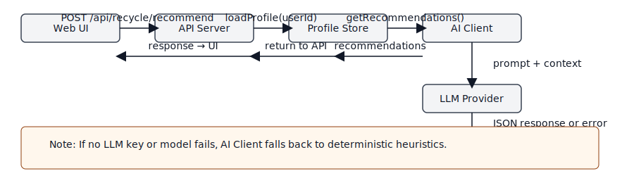
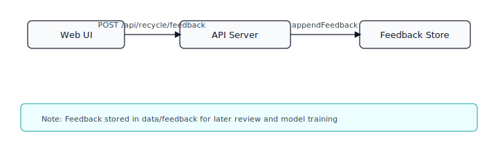
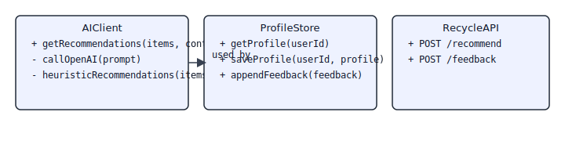
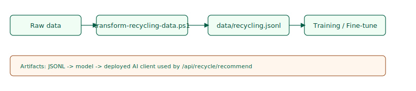
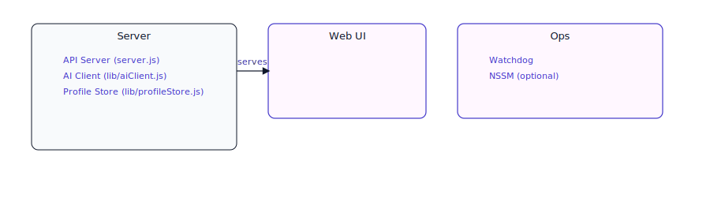

 # Developer Reverse-Engineering Guide 🔍

 This document helps developers understand the architecture and code flow of the project so you can inspect, extend, debug, and test the app.

 ## Quick overview
 - Project: NetworkBuster (server, web UI, scripts, tooling, AI features)
 - Primary runtime: Node.js (server.js)
 - Key languages: JavaScript (ESM), PowerShell for automation & Windows service helpers
 - New feature: AI-powered recycling assistant (see `api/recycle.js`, `lib/aiClient.js`)

 ## High-level architecture

 - `server.js`  — Express-based HTTP server and entry point. Exposes `/api/*` endpoints and serves `web-app/` static files.
 - `api/`       — server-side routers. `api/recycle.js` contains recycling endpoints (recommend, feedback).
 - `lib/`       — helpers and domain logic. `lib/aiClient.js` wraps LLM calls with heuristic fallback; `lib/profileStore.js` manages local JSON profiles and feedback storage.
 - `web-app/`   — static frontend pages and simple client JS (`recycle.html`, `recycle.js`).
 - `scripts/`   — admin & operational helpers (install-service-nssm.ps1, watchdog.ps1, installer helpers, transforms, tests).
 - `data/`      — runtime data: `profiles/` and `feedback/` (JSON files). Do not leak these to external services without consent.

 ## How requests flow (AI feature example)

 1. Client (UI or API consumer) POSTs to `/api/recycle/recommend` with items + optional userId.
 2. `api/recycle.js` loads the user profile (if present) from `lib/profileStore.js` and merges preferences.
 3. `api/recycle.js` calls `lib/aiClient.getRecommendations(items, context, prefs)`.
 4. `lib/aiClient` attempts an LLM call (OpenAI) if `OPENAI_API_KEY` is set; it expects JSON-like output and falls back to deterministic heuristics if the model fails or no key is present.
 5. The API responds with `recommendations` and `source` (e.g., `llm`, `heuristic`, or `fallback`). Feedback endpoints write JSON to `data/feedback/` for later review & training.

 ## Key files to inspect
 - `server.js` — start here to see middleware, endpoints registration, and static file serving.
 - `api/recycle.js` — API contract and request handling for recycling features.
 - `lib/aiClient.js` — where LLM calls are made and heuristics implemented. Add provider adapters here.
 - `lib/profileStore.js` — simple filesystem-based profile & feedback storage.
 - `scripts/install-service-nssm.ps1` — see how the service is registered and NSSM is managed on Windows.

 ## Running locally (dev)

 1. Ensure Node (24.x) is available or use the repo-local portable node (`tools/node` when present).
 2. Install dependencies in the repo root:

 ```powershell
 npm install --no-audit --no-fund
 ```

 3. Start the server (dev):

 ```powershell
 node server.js
 # server listens on port 3001 by default (see env PORT)
 ```

 4. Open the recycling UI: `http://localhost:3001/recycle.html` (or the server root if configured to serve).

 5. Quick test using PowerShell helper:

 ```powershell
 .\scripts\test-recycle-api.ps1
 ```

 ## Debugging tips

 - Check server logs (console output) and `/logs` for watchdog/service logs.
 - If LLM output is unexpected, inspect the `raw` field returned from `lib/aiClient.getRecommendations` for model text.
 - Use `scripts/set-openai-key.ps1` to set `OPENAI_API_KEY` for testing with OpenAI.

 ## How to extend the AI integration

 1. Add provider adapters to `lib/aiClient.js` (wrap calls and normalize responses).
 2. If you add a retriever/knowledge base, add a new module like `lib/retriever.js` and call it from `aiClient` prior to prompt construction.
 3. Store curated feedback JSON lines in `data/feedback/` and add a transform script to convert them into training JSONL (`scripts/transform-recycling-data.ps1` is an example).

 ## Testing & CI

 - A demo workflow `/.github/workflows/recycle-ai-demo.yml` shows how to run a simple demo using `OPENAI_API_KEY` from repo secrets.
 - Add unit tests for `lib/aiClient.js` and `api/recycle.js` to validate heuristics and API contract.

 ## Security & privacy notes

 - Profiles/feedback should be handled with consent. Avoid sending PII to LLMs unless consented and masked.
 - Keep secrets out of source control: use `.env` (gitignored) for local dev and GitHub Secrets for CI.

 ## Rollback & investigation checklist

 - To inspect the Windows service: `Get-Service -Name NetworkBuster` and `sc.exe qc NetworkBuster`.
 - To stop/remove the NSSM service (if installed): `nssm stop NetworkBuster` and `nssm remove NetworkBuster confirm` (run elevated).
 - Logs: `S:\NetworkBuster_Production\logs` or repo `logs` folder for local runs.

 ---

## Diagrams

Sequence diagrams and additional diagrams are in `docs/diagrams/`:

- `recycle-sequence.mmd` — request flow for `/api/recycle/recommend` (LLM + fallback)

  

- `feedback-sequence.mmd` — UI feedback flow into `data/feedback`

  

- `watchdog-sequence.mmd` — watchdog health check and restart loop

  

- `class-ai-profile.mmd` — class diagram of AIClient/ProfileStore/RecycleAPI

  

- `data-pipeline.mmd` — data transform -> JSONL -> training -> deployed model

  

- `component-overview.mmd` — component diagram overview of server, UI, and ops

  

You can also render the `.mmd` files to SVG locally using the helper script (if you prefer to generate them yourself):

```powershell
.\scripts\render-mermaid.ps1
```

If you'd like, I can also generate a class diagram or extra sequence diagrams, add sample unit tests, or create a short screencast demo. What would you like next? 🚀
